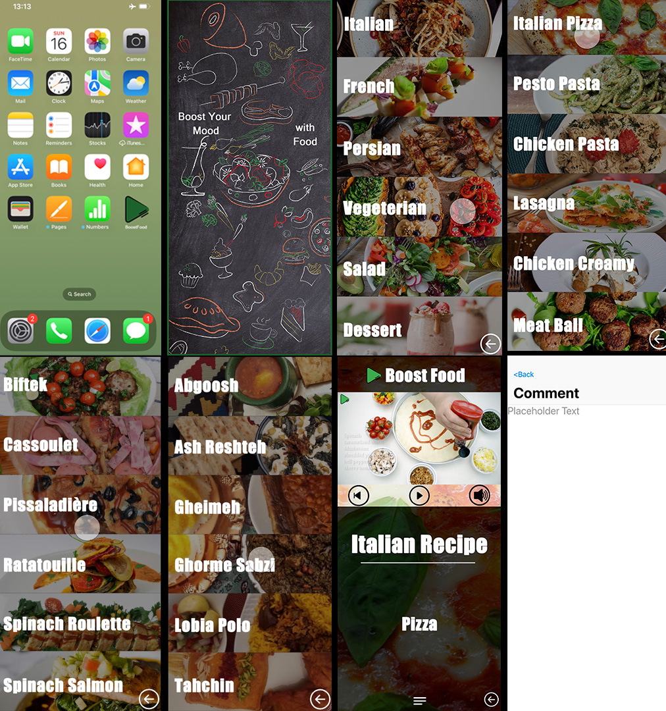
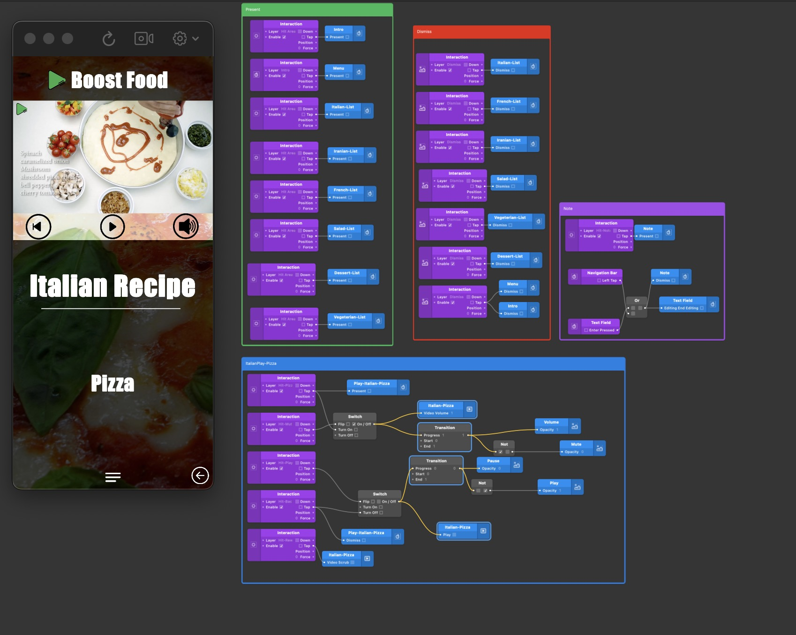

  <h1 align="center">Prototyping with Origami Studio - Cook Learning by video  🧑‍💻</h1>
  <h2>Working with Origami Studio is enjoyable</h2>
<h2>Goals</h2>
  <ul>
  <li>
UX Prototypinng with Origami Studio</li>
  <li>
  Working with Patches and Layers
  </li>
     <li>
  Interactio, Switch, Transition
    </li>
    
   </ul>

  

    Screenshot-1:
  

  

  

    Screenshot-2:
  

  

## Requirements
- Origami Studio Version 138.0
